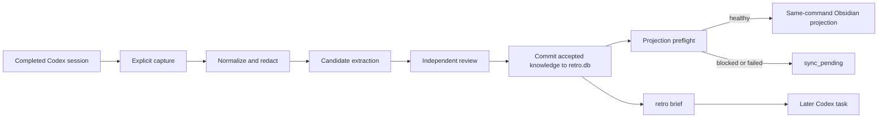

# AgentRetro MVP Design

**Status:** Approved for specification and planning

**Decision fingerprint:** `agentretro-mvp-design-decision-convergence:v1:sha256:b379d027f1111d9a6c31a58860617200e2f8a4bf905dc3ba5f0d4440be3c97b5`

**Revision approval:** 2026-07-17; automatic same-command projection, sensitive purge, canonical global AGENTS target, managed project mappings, deterministic local brief ranking, and bounded performance all selected as option A.

## Problem

The existing `ai-todo` product manages Todo and WorkItem workflows, but it does not turn completed Codex sessions into durable, evidence-backed knowledge. Users must repeatedly restate project context, prior decisions, known failure modes, and current task state. The MVP must add this retrospective capability without replacing or behaviorally coupling it to the existing product.

## Goals

- Capture a completed local Codex session only when the user explicitly requests it.
- Extract `RULE`, `LESSON`, and `TASK_STATE` knowledge with traceable evidence.
- Automatically accept only high-confidence candidates that pass deterministic safety gates.
- Preserve a human-readable projection of accepted knowledge in an Obsidian vault.
- Provide concise, task-specific context to later Codex tasks through `retro brief`.
- Keep all writes auditable, bounded, idempotent, and recoverable.
- Preserve the existing `ai-todo` commands, Todo/WorkItem behavior, and data.

## Non-goals

- Claude, Gemini, or other session sources.
- Hooks, background capture, or filesystem watchers.
- Web, GUI, MCP Server, embeddings, clustering, or a vector database.
- Migration of Todo or WorkItem records into AgentRetro.
- Copying complete raw Codex sessions into AgentRetro storage.
- Automatic deep rewriting of user-authored Obsidian prose.
- Editing Codex-generated memory state under `<codex-home>/memories`.
- Automatically modifying global Codex guidance during installation.

## Product Boundary

The repository exposes two sibling products:

- Existing: `ai-todo = ai_todo_assistant.presentation.cli:main`
- New: `retro = agent_retro.presentation.cli:main`

`agent_retro` has its own `domain`, `application`, `infrastructure`, and `presentation` packages. It does not import the existing Todo, WorkItem, workflow, or CLI domains. The only allowed cross-product seam is a read-only adapter that obtains the existing model configuration and builds the existing LLM client.

AgentRetro-specific configuration and state live under `<user-home>/.agentretro/`. The existing `data/todos.db` and all existing product configuration semantics remain unchanged.

## System Flow



## CLI Surface

```text
retro capture --last
retro capture --session <session-id>

retro review
retro review show <candidate-id>
retro review accept <candidate-id>
retro review edit <candidate-id>
retro review reject <candidate-id>
retro review merge <conflict-id>
retro review retry --candidate <candidate-id>
retro review retry --session <session-id>

retro kb list
retro kb show <knowledge-id>
retro kb archive <knowledge-id>
retro kb purge plan <knowledge-id>
retro kb purge apply <plan-id> --confirm-operation <operation-id>  # repeat for every operation

retro project map --root <git-root> --vault-project <project-name>
retro project list
retro project remove <mapping-id>
retro project reclassify <session-id> --mapping <mapping-id>

retro brief "<current-task>" --project <project>
retro sync status
retro sync retry
retro sync reconcile

retro integrate codex
retro integrate codex --apply
retro integrate codex --remove

retro doctor
```

Human output defaults to Simplified Chinese. `--json` uses stable English field names and enum values.

## Configuration

`<user-home>/.agentretro/config.json` contains only AgentRetro settings:

- database path;
- Obsidian vault root;
- review thresholds;
- `brief` token budget;
- backup directory;
- discovery, session-size, model-request, and brief-render limits.

Project mappings are audited domain state in SQLite, not mutable JSON configuration. Configuration defaults are: inspect at most the newest 1000 candidate session files within 10 seconds, reject a source session larger than 128 MiB, use the filtered existing model timeout or 120 seconds when absent, and stop local brief rendering after 5 seconds. Every limit is configurable, and a limit failure creates no partial capture or projection state.

The read-only legacy configuration adapter exposes only `auth_mode`, `api_base`, `api_key`, `model`, timeout, and retry settings to the LLM client. It must never serialize, log, copy, or persist credential values. If model configuration is unavailable, capture, existing knowledge lookup, and `brief` remain usable while model-dependent candidates stay pending.

## Persistence Model

SQLite at `<user-home>/.agentretro/retro.db` is the authority for review state, versions, evidence, and synchronization metadata.

| Entity | Responsibility |
|---|---|
| `sessions` | Source session identity, hash, project, event cursor, and capture status |
| `evidence` | Source locator, content hash, kind, and minimal redacted excerpt |
| `candidates` | Type, proposed text, extraction confidence, review verdict, and reason |
| `review_attempts` | Candidate or session review request hash, attempt result, and failure reason |
| `knowledge` | Accepted text, version, scope, status, validity, and acceptance actor |
| `knowledge_evidence` | Many-to-many knowledge-to-evidence links |
| `conflicts` | Active and proposed item pair, reason, merge proposal, and resolution state |
| `sync_jobs` | Target files, pre/post hashes, retries, rollback, and error state |
| `project_mappings` | Git root and remote identity to Obsidian project mapping |
| `purge_jobs` | Sensitive-content locations, exact operation IDs, results, and incomplete cleanup state |
| `audit_log` | Immutable lifecycle actions with actor and before/after hashes |

The lifecycle is:

```text
captured
-> extracted
-> pending_review
-> auto_accepted / accepted / edited / rejected
-> synced / sync_pending
-> archived / purge_pending / purged / purge_incomplete
```

Database schema changes use versioned migrations. Before migration, AgentRetro creates a database backup. Migration failure restores the backup and aborts startup.

## Codex Session Capture

- `--last` selects the newest completed session, never an active session.
- `--session` captures one explicit session ID.
- Session discovery uses the real local Codex home, not the existing product's isolated Codex runtime directory.
- Discovery sorts candidate files by completion metadata or file modification time, streams JSONL line by line, and enforces the configured file-count, deadline, and source-size limits.
- Session ID, event locator, and content hash make capture idempotent.
- Unknown event kinds are ignored and recorded; missing required identity fields make the session unsupported rather than guessed.
- Project routing uses Git root, normalized remote identity, and a local mapping table. Ambiguous or unknown projects remain pending and cannot auto-accept or synchronize.
- Raw session files are not copied. Evidence contains only a source reference, content hash, and the smallest redacted excerpt necessary to support a claim.

All session and vault content is treated as untrusted data. Instructions found inside captured content cannot cause command execution, file writes, or tool calls.

### Project Mapping Lifecycle

`retro project map` resolves the supplied Git root, normalizes its remote identity, validates the configured Obsidian vault and project target, then stores one audited mapping. Duplicate roots with incompatible remotes, duplicate remote identities with incompatible vault targets, path traversal, and symlink escape are rejected.

`list` shows mapping ID, resolved root, normalized remote, and vault project without credentials. `remove` disables future routing and projection but does not delete knowledge or vault content. `reclassify` attaches an awaiting session to an existing mapping and resumes candidate review from stored evidence without recapturing the source. Remote or worktree changes that produce more than one possible mapping remain blocked until the user reclassifies them.

## Knowledge Semantics

### RULE

A durable constraint or preference. It requires explicit evidence from the user, an applicable `AGENTS.md`, or another authoritative project source. Inferred habits cannot become rules automatically.

### LESSON

A reusable failure pattern. It requires evidence for the failure, the cause or correction, and a successful verification result.

### TASK_STATE

An observable status, blocker, decision, or next action. It expires after 14 days by default. Expiration marks the item stale; it does not delete it.

Project scope is the default. Promotion to global scope is always explicit.

## Extraction and Review

Review is deliberately split:

1. The extraction pass creates typed candidates and binds evidence.
2. The independent review pass receives only the redacted candidate and evidence and returns `ACCEPT`, `EDIT`, or `REJECT`, confidence, reason, duplicate assessment, conflict assessment, and a normalized text suggestion.
3. Deterministic gates run after the model verdict.

Automatic acceptance thresholds are:

- `RULE >= 0.97`
- `LESSON >= 0.93`
- `TASK_STATE >= 0.90`

Any of the following blocks automatic acceptance regardless of confidence:

- possible secret or credential;
- missing or unlocatable evidence;
- unknown project;
- duplicate candidate;
- conflict with active knowledge;
- speculation presented as fact;
- `RULE` without an explicit authoritative source;
- `LESSON` without successful verification.

When knowledge conflicts, the old item remains active. The new item stays pending with a merge proposal and is excluded from `brief` until resolved.

Model failure leaves candidates pending. `retro review retry` creates a new audited review attempt for one candidate or every pending candidate from one captured session. It reuses the stored redacted candidate and evidence, never repeats extraction, and uses candidate ID plus review-input hash for idempotency. A failed retry stays retryable; a successful retry proceeds through the same thresholds and deterministic gates as the original attempt.

## Redaction

Redaction runs before model input and again before database or vault persistence. It covers API keys, tokens, cookies, authorization headers, passwords, private keys, and common connection credentials. Logs must not contain raw prompts, complete model responses, credential values, or complete session excerpts.

## Obsidian Projection

For a mapped project, AgentRetro manages exactly three aggregate files:

```text
<obsidian-vault>/项目/<project>/AgentRetro/规则.md
<obsidian-vault>/项目/<project>/AgentRetro/经验.md
<obsidian-vault>/项目/<project>/AgentRetro/任务状态.md
```

Each item has a stable ID, type, state, scope, confidence, source reference, version, and update time. Archived items remain inside an `已归档` section of their type file.

Automatic synchronization may modify only:

- the three aggregate files;
- a marked AgentRetro summary block in a mapped project page;
- a marked AgentRetro link block in the vault index;
- append-only AgentRetro entries in the vault log.

Managed summary boundaries are explicit:

```html
<!-- agentretro:summary:start project=<project> -->
...
<!-- agentretro:summary:end -->
```

Text outside managed markers must remain byte-for-byte unchanged during automatic synchronization.

### Automatic Projection Trigger

Any committed transition that changes project-scoped projection content—automatic acceptance, manual acceptance or edit, reviewed vault adoption, conflict resolution, archive, or completed purge—creates one deterministic projection event. The command commits SQLite first, then synchronously attempts one batched projection for the affected project.

Projection runs only when project mapping, vault containment, managed markers, target hashes, and rollback state pass preflight. A blocked or failed attempt leaves SQLite knowledge active, records `sync_pending` with a stable reason, and returns a warning plus `retro sync retry`; it never reports the vault as current. Repeating the same event or retry must produce identical bytes and no duplicate log entry. This trigger never authorizes deep merge outside managed boundaries.

## Managed Merge

`retro merge plan` can analyze user-authored project notes and produce a semantic merge diff without writing files. Only `retro merge apply <plan-id>` may modify content outside managed blocks.

Apply requires:

- a displayed target-file list and complete diff;
- explicit confirmation for that plan;
- current hashes matching the plan's input hashes;
- no unconfirmed delete, rename, or move;
- no unresolved conflict;
- post-write readback verification.

Any external edit invalidates the plan and requires regeneration.

## SQLite and Vault Consistency

SQLite is the structured system of record; Obsidian is the readable projection. `retro brief` reads accepted SQLite knowledge so a `sync_pending` vault does not expose stale context to Codex.

AgentRetro records hashes for every managed vault block. A manual edit to managed content creates `external_edit_conflict`; the next sync must stop rather than overwrite it. `retro sync reconcile` lets the user keep the database version, adopt the vault version as an edited candidate, or edit and merge manually. Silent bidirectional overwrite is forbidden.

## Obsidian Write Transaction and Rollback

Every synchronization run:

1. validates the vault, project mapping, target containment, and managed markers;
2. records SHA-256 for all target files;
3. backs up all pre-write files under `<user-home>/.agentretro/backups/<run-id>/`;
4. creates a SQLite synchronization journal;
5. writes same-directory temporary files;
6. replaces target files atomically;
7. reads back and verifies hashes and markers;
8. restores every pre-write file if any step fails;
9. enters `rollback_required` and stops all later synchronization if restoration fails.

MVP does not automatically delete ordinary migration, synchronization, or merge backups. Sensitive purge is the only exception and supersedes ordinary retention for locations that contain the purged content.

### Sensitive Purge

Ordinary removal remains archive-only. `retro kb purge plan` searches every AgentRetro-owned copy that provenance can identify: active and historical SQLite text/excerpts, audit detail, managed Obsidian content, AgentRetro logs and model traces, and database, synchronization, or merge backups. The immutable plan lists every location and assigns an exact operation ID.

`purge apply` requires confirmation for every operation and uses the journaled write protocol for filesystem changes. It retains only a tombstone containing entity identity, timestamps, actor, operation status, and non-reversible metadata; it cannot retain source text, summaries, excerpts, or a reversible content hash. If any known location cannot be cleaned or verified, the job becomes `purge_incomplete`, later automatic projection is blocked for that item, and the command cannot report success. Copies outside AgentRetro provenance are reported as an explicit residual-risk warning rather than claimed as deleted.

## Codex Integration

`retro brief "<task>"` first filters to active, eligible project and explicitly promoted global knowledge, then selects in order:

1. active project `RULE` items;
2. explicitly promoted global `RULE` items;
3. current, non-expired `TASK_STATE` items;
4. relevant `LESSON` items;
5. warnings about conflicts, stale state, or synchronization failure.

Lesson relevance is deterministic and local: normalize task and knowledge text with Unicode NFKC and case folding, tokenize CJK characters and Latin alphanumeric terms, score fixed keyword overlap, recency, and evidence quality weights, then use stable knowledge ID as the final tie-break. It does not call a model or vector database. Token usage is conservatively estimated as `ceil(UTF-8 byte length / 3)`. Items are never truncated. Omitted items are listed by ID and reason; if eligible rules alone exceed the budget, brief generation fails with a request to increase the configured budget rather than silently dropping a rule. Default output is capped at approximately 6000 estimated tokens, contains evidence references, and must render within the configured local deadline.

`retro integrate codex` resolves exactly `<effective-codex-home>/AGENTS.md` and previews its managed-block diff. It never targets `AGENTS.override.md`. Only `--apply` writes the canonical file. Integration must:

- back up the target and verify the pre-write hash;
- add or update one uniquely marked block;
- preserve all text outside that block byte-for-byte;
- stop if the managed block was edited manually;
- support `--remove`, which removes only the managed block;
- reject path traversal or symlink escape from the effective Codex home;
- preserve the existing encoding and newline convention;
- create a missing canonical file only after its creation appears in preview;
- refuse apply or removal while `<effective-codex-home>/AGENTS.override.md` exists, because effective precedence is ambiguous;
- read back and verify after apply or remove, then run a non-writing smoke that confirms the managed block is discoverable from the effective Codex home.

The installed guidance asks Codex to run `retro brief` only for tasks that depend on project history, user preferences, prior decisions, or current task state. It must not scan the entire vault for every task. AgentRetro never edits native Codex memory files or memory settings.

## Failure Behavior

| Failure | Required behavior |
|---|---|
| Session parse failure | Record the run; create no incomplete knowledge |
| Model unavailable | Keep the candidate pending and retryable |
| Review retry fails | Record the attempt and keep the candidate pending without repeating extraction |
| Project mapping unknown or ambiguous | Keep the session awaiting classification and expose map/reclassify actions |
| Database migration failure | Restore the database backup and abort |
| Obsidian sync failure | Keep accepted knowledge and mark `sync_pending` |
| External vault edit | Stop and create `external_edit_conflict` |
| Stale merge plan | Refuse apply and require regeneration |
| Global guidance hash mismatch | Refuse integration and preserve the file |
| `AGENTS.override.md` exists | Report precedence conflict and refuse global integration writes |
| Sensitive purge cannot clean a known copy | Mark `purge_incomplete`, block success, and report the remaining location |
| Discovery, source-size, model, or brief limit reached | Stop with a stable diagnostic and create no partial state |

## Security and Privacy

- Writes must remain inside configured AgentRetro state, backup, and vault targets.
- Path traversal, unexpected symlink escape, and out-of-scope paths are rejected.
- No captured text can authorize commands or writes.
- Ordinary deletion is an archive operation.
- Sensitive purge requires an immutable impact plan and exact per-operation confirmation, removes every verifiable AgentRetro-owned copy including affected backups, and leaves a content-free audit tombstone.
- Automated tests use temporary Codex and Obsidian directories and never modify real user state.

## Compatibility

- Existing `ai-todo` tests and storage behavior must remain unchanged.
- AgentRetro adds no ORM and uses Python's SQLite support.
- Python 3.10 remains the minimum runtime.
- The new CLI must be safe under Windows GBK and UTF-8 consoles.
- The existing Windows non-interactive output defect may be fixed as an isolated compatibility task, but no Todo or WorkItem semantics may change.

## Acceptance Criteria

- Re-capturing the same session creates no duplicate session, evidence, candidate, or knowledge record.
- Secret fixtures never appear in model-input logs, SQLite, logs, or Obsidian output.
- Type thresholds and every hard gate are covered by deterministic tests.
- Conflicting candidates cannot replace or enter `brief` alongside active knowledge.
- Expired `TASK_STATE` records are excluded from default `brief` output.
- Injected multi-file write failure restores every target to its exact pre-write hash.
- No deep merge writes before explicit apply; a changed input hash blocks apply.
- Codex integration defaults to preview and never changes text outside its managed block.
- Accepted projection-changing transitions attempt one same-command synchronization; preflight or write failure produces `sync_pending` without losing accepted SQLite knowledge.
- Project mappings can be added, inspected, removed, and used to reclassify an awaiting session without recapture.
- Review retry does not duplicate candidates or evidence and remains retryable after a model failure.
- Identical task and knowledge inputs produce byte-identical briefs and stable omission lists.
- Sensitive purge cannot report success while a known AgentRetro-owned copy remains.
- Codex integration targets only the canonical effective-home `AGENTS.md` and refuses writes when an override file exists.
- Every OpenSpec scenario has a stable ID and at least one mapped test or acceptance task.
- Discovery, session parsing, model calls, and brief rendering enforce configured limits with diagnostic failures.
- A temporary Codex session and temporary Obsidian vault complete capture, review, sync, and brief end to end.
- `retro --help`, capture, review, and brief render successfully in Windows GBK and UTF-8 environments.
- The complete existing `ai-todo` test suite passes and the existing database remains unchanged.

## Delivery Sequence

1. Independent package, configuration, SQLite migrations, and Unicode-safe CLI.
2. Codex parser, normalization, evidence, redaction, bounded discovery, and managed project routing.
3. Two-pass extraction and review, retry, lifecycle, conflicts, knowledge management, and sensitive purge.
4. Three-file same-command Obsidian projection, managed summaries, transaction journal, retry, and rollback.
5. Merge planning, explicit apply, and external-edit reconciliation.
6. Deterministic `retro brief`, doctor checks, and canonical global AGENTS integration.
7. Scenario-mapped regression, temporary-vault integration, failure injection, performance limits, and Windows smoke verification.
